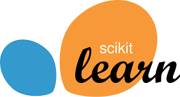

# Data Mining Project

## 📖 Deskripsi Proyek

Proyek ini berisi latihan dan praktikum yang saya lakukan pada mata kuliah Data Mining. Fokus utama dari proyek ini adalah memahami konsep dan penerapan teknik-teknik data mining, termasuk preprocessing data, clustering, klasifikasi, dan analisis data log.

---

## 🛠️ Fitur

- **Preprocessing Data**: Membersihkan dan menyiapkan data untuk analisis lebih lanjut.
- **Clustering**: Implementasi algoritma clustering seperti K-Means dan DBSCAN.
- **Klasifikasi**: Latihan menggunakan model klasifikasi seperti Random Forest, Logistic Regression, dan lainnya.

---

## 📂 Struktur Direktori

```
.
├── assets/          # Folder berisi logo dan gambar pendukung
├── Dataset_daun/    # salah satu dataset yang digunakan
├── Praktikum/       # Berisi Jupyter Notebook yang digunakan pada tugas dan praktikum saya
├── tugas/           # Berisi Project Final dari Mata Kuliah Data Mining
├── README.md        # File ini
```

---

## 🖥️ Teknologi yang Digunakan

| Library          | Logo                                     |
| ---------------- | ---------------------------------------- |
| **Python**       |              |
| **Pandas**       |              |
| **Scikit-learn** |  |
| **Matplotlib**   |      |

---

<!-- ## 📊 Contoh Visualisasi

### Contoh Pie Chart


### Contoh Bar Chart


--- -->

## 📈 Hasil Akhir

Proyek ini membantu saya memahami dasar-dasar data mining serta penerapan model machine learning pada berbagai jenis data, termasuk data log dan teks.

---

## 🤝 Kontribusi

Kontribusi sangat diterima! Jika Anda memiliki ide atau saran, silakan ajukan pull request atau buat issue.

---

## 📧 Kontak

Untuk pertanyaan atau diskusi lebih lanjut, hubungi saya di:

- Email: akmalshahibmaulana@gmail.com
- LinkedIn: [Akmal Shahib Maulana](https://www.linkedin.com/in/akmal-shahib-maulana)

---

Terima kasih telah mengunjungi proyek saya! 🚀
